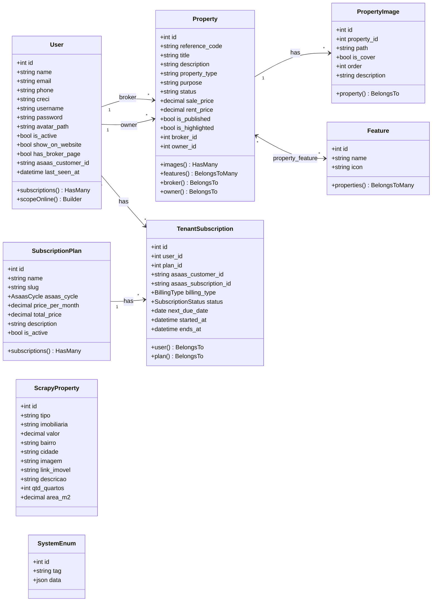
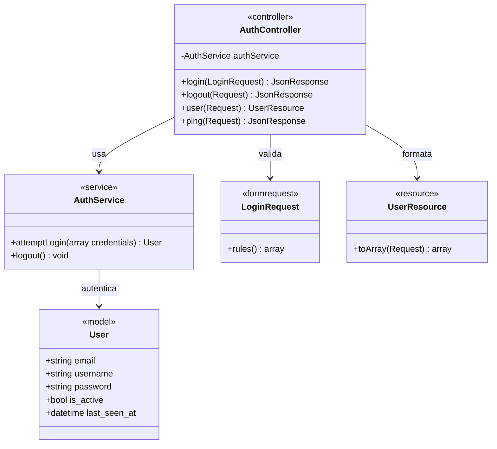
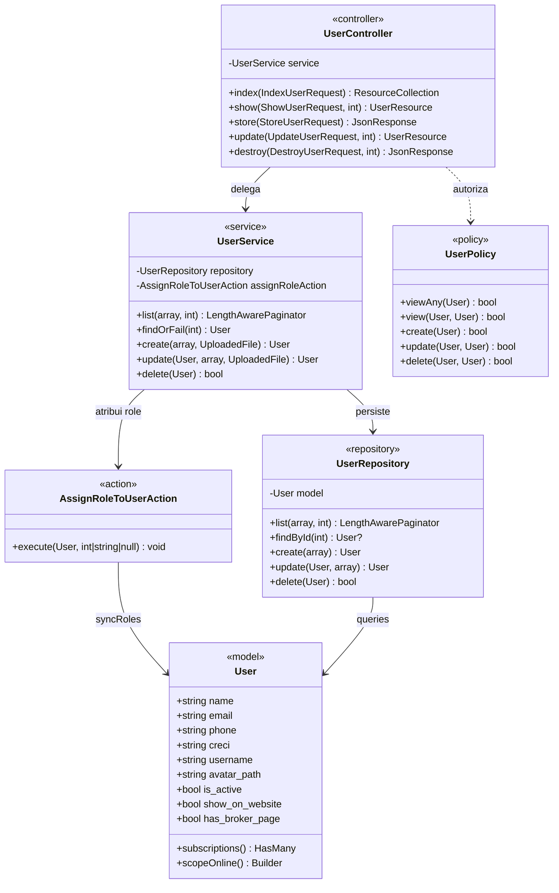
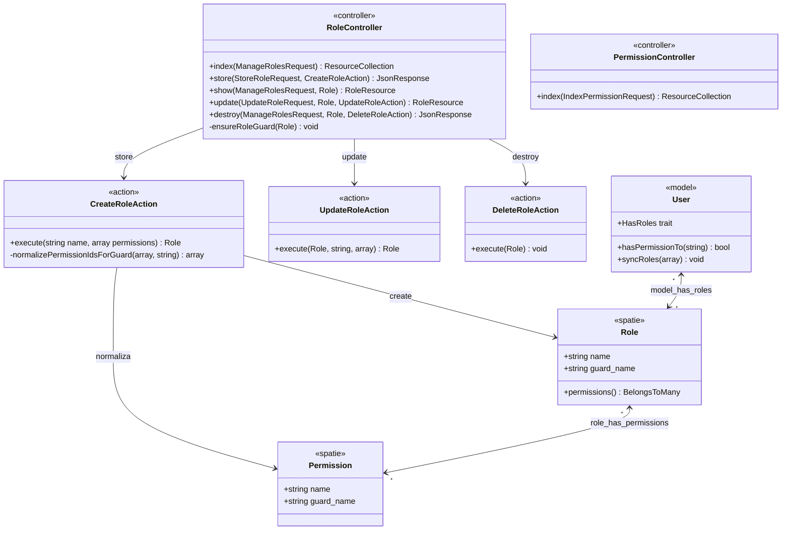
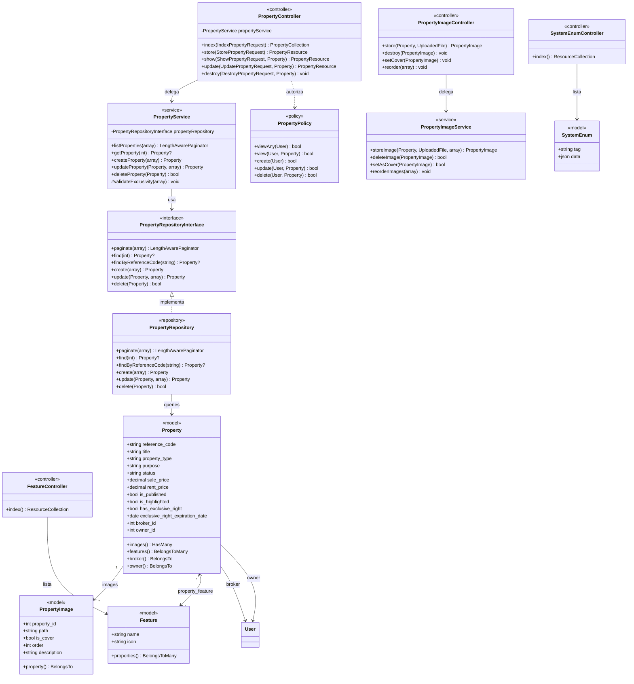
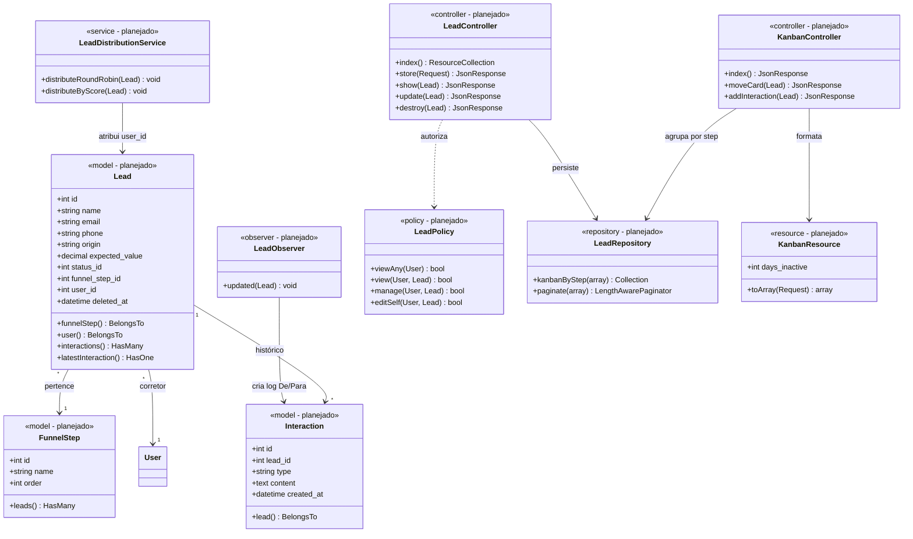
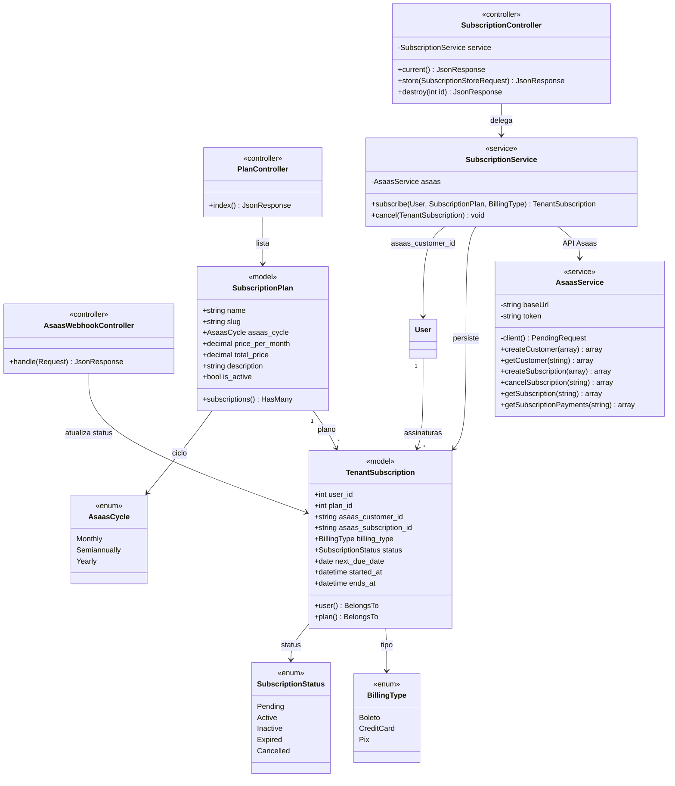
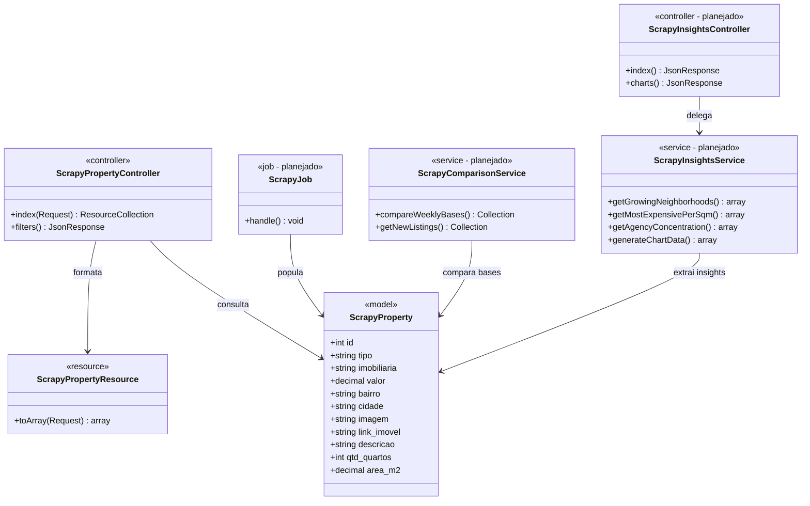
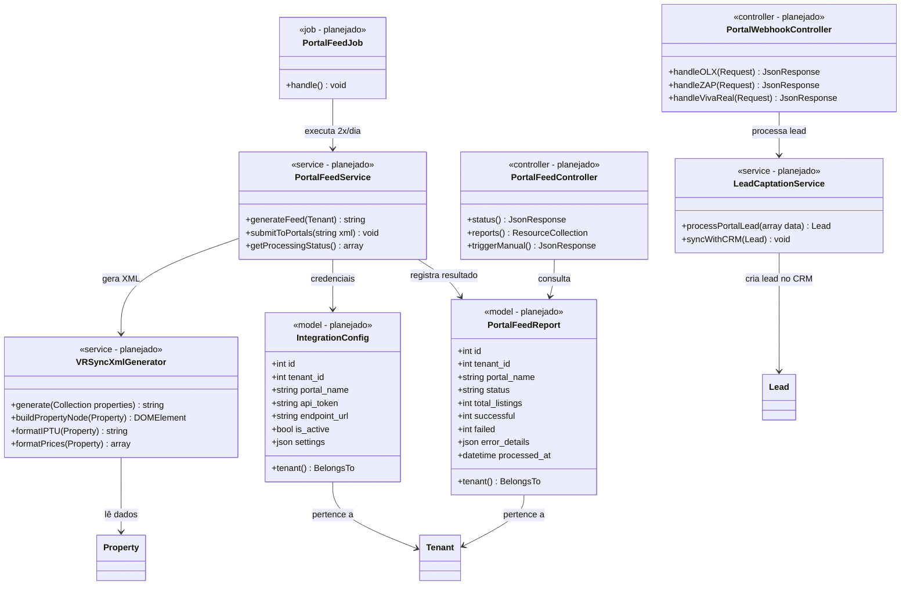

# Diagramas de Classe — ia-imob

> Documentação gerada a partir da análise do código-fonte existente e das especificações técnicas dos módulos planejados.
> Cada seção corresponde a uma feature do [PRD](file:///home/vinicius/apps/ia-imob/docs/roadmaps/PRD.md).

---

## Sumário

1. [Diagrama Geral de Entidades](#1-diagrama-geral-de-entidades)
2. [Login e Autenticação](#2-login-e-autenticação)
3. [Gestão de Usuários](#3-gestão-de-usuários)
4. [Grupos de Usuários — RBAC](#4-grupos-de-usuários--rbac)
5. [Cadastro de Imóveis](#5-cadastro-de-imóveis)
6. [Gestão de Leads — CRM](#6-gestão-de-leads--crm)
7. [Gerador de Sites White-Label — B2B SaaS](#7-gerador-de-sites-white-label--b2b-saas)
8. [Pagamento Recorrente — Asaas](#8-pagamento-recorrente--asaas)
9. [AI Searcher — Base Consolidada de Jaraguá](#9-ai-searcher--base-consolidada-de-jaraguá)
10. [Ecossistema de Integração](#10-ecossistema-de-integração)

---

## 1. Diagrama Geral de Entidades

Visão de alto nível de **todos os Models** e seus relacionamentos.

---

## 2. Login e Autenticação

**Status:** ✅ Implementado

---

## 3. Gestão de Usuários

**Status:** ✅ Implementado

---

## 4. Grupos de Usuários — RBAC

**Status:** ✅ Implementado — via `spatie/laravel-permission`

---

## 5. Cadastro de Imóveis

**Status:** 🔧 Em Desenvolvimento

---

## 6. Gestão de Leads — CRM

**Status:** 📋 Planejado — [Especificação](file:///home/vinicius/apps/ia-imob/docs/technical-implementations/gestao-leads/laravel/especificacao.md)

---

## 7. Gerador de Sites White-Label — B2B SaaS

**Status:** 📋 Planejado — [Especificação](file:///home/vinicius/apps/ia-imob/docs/technical-implementations/b2b-site-builder/laravel/especificacao.md) | [Arquitetura](file:///home/vinicius/apps/ia-imob/docs/complex-plans/b2b-multi-tenant-website-builder.md)

```mermaid
classDiagram
    direction TB

    class Tenant {
        <<model - planejado>>
        +int id
        +string name
        +string document
        +string email
        +bool is_active
        +datetime deleted_at
        +domains() HasMany
        +siteSetting() HasOne
        +users() HasMany
        +properties() HasMany
        +siteVersions() HasMany
    }

    class TenantDomain {
        <<model - planejado>>
        +int id
        +int tenant_id
        +string domain
        +bool is_primary
        +bool is_verified
        +tenant() BelongsTo
    }

    class TenantSiteSetting {
        <<model - planejado>>
        +int id
        +int tenant_id
        +string theme_slug
        +string primary_color
        +string secondary_color
        +string logo_path
        +string favicon_path
        +string whatsapp_number
        +string instagram_url
        +tenant() BelongsTo
    }

    class SiteVersion {
        <<model - planejado>>
        +int id
        +int tenant_id
        +json settings_snapshot
        +string description
        +datetime created_at
        +tenant() BelongsTo
    }

    class BelongsToTenant {
        <<trait - planejado>>
        +booted() void
    }

    class IdentifyTenantByDomain {
        <<middleware - planejado>>
        +handle(Request, Closure) Response
    }

    class SiteSettingController {
        <<controller - planejado>>
        +show() JsonResponse
        +update(UpdateSiteSettingRequest) JsonResponse
    }

    class DomainController {
        <<controller - planejado>>
        +index() ResourceCollection
        +store(Request) JsonResponse
        +destroy(TenantDomain) JsonResponse
    }

    class PublicPropertyController {
        <<controller - planejado>>
        +index(Request) ResourceCollection
        +show(string reference_code) JsonResponse
    }

    class PublicSiteSettingController {
        <<controller - planejado>>
        +show() JsonResponse
    }

    class UpdateTenantSiteSettingsAction {
        <<action - planejado>>
        +execute(Tenant, array data) TenantSiteSetting
    }

    class UpdateSiteSettingRequest {
        <<formrequest - planejado>>
        +rules() array
    }

    class PublicPropertyRepository {
        <<repository - planejado>>
        +paginate(array) LengthAwarePaginator
    }

    class PublicPropertyResource {
        <<resource - planejado>>
        +toArray(Request) array
    }

    Tenant "1" --> "*" TenantDomain : domains
    Tenant "1" --> "1" TenantSiteSetting : setting
    Tenant "1" --> "*" SiteVersion : versões
    Tenant "1" --> "*" User : users
    Tenant "1" --> "*" Property : properties

    SiteSettingController --> UpdateTenantSiteSettingsAction : delega
    SiteSettingController --> UpdateSiteSettingRequest : valida
    DomainController --> TenantDomain : CRUD
    PublicPropertyController --> PublicPropertyRepository : consulta
    PublicPropertyController --> PublicPropertyResource : formata
    PublicSiteSettingController --> TenantSiteSetting : lê
    IdentifyTenantByDomain --> TenantDomain : resolve
    BelongsToTenant --> Tenant : Global Scope

    User ..> BelongsToTenant : usa trait
    Property ..> BelongsToTenant : usa trait
```

---

## 8. Pagamento Recorrente — Asaas

**Status:** ✅ Implementado

---

## 9. AI Searcher — Base Consolidada de Jaraguá

**Status:** ✅ Implementado (parcial — Jobs e Insights planejados)

---

## 10. Ecossistema de Integração

**Status:** 📋 Planejado — Requisitos PAC seções 8 e 9

---

## Legenda

| Estereótipo | Descrição |
|:---:|:---|
| `<<model>>` | Eloquent Model (implementado) |
| `<<model - planejado>>` | Model previsto na especificação técnica |
| `<<service>>` | Service Layer class |
| `<<controller>>` | HTTP Controller |
| `<<repository>>` | Repository Pattern class |
| `<<policy>>` | Laravel Policy (autorização) |
| `<<action>>` | Single-responsibility Action class |
| `<<enum>>` | PHP 8.1 Backed Enum |
| `<<formrequest>>` | Laravel Form Request (validação) |
| `<<resource>>` | API Resource (serialização) |
| `<<trait>>` | PHP Trait reutilizável |
| `<<middleware>>` | HTTP Middleware |
| `<<observer>>` | Eloquent Observer |
| `<<job>>` | Laravel Queue Job |
| `<<spatie>>` | Classe do pacote `spatie/laravel-permission` |

### Notação de Relacionamentos

| Símbolo | Significado |
|:---:|:---|
| `-->` | Associação / Dependência direta |
| `<\|..` | Implementação de interface |
| `<-->` | Muitos-para-muitos (M:N) |
| `..>` | Dependência fraca / usa |
| `"1" --> "*"` | Um-para-muitos (1:N) |
| `"1" --> "1"` | Um-para-um (1:1) |
