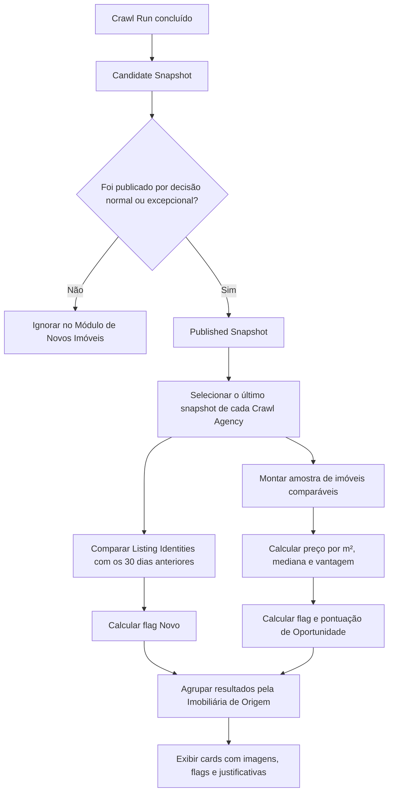

# Definição de Novos Imóveis e Oportunidades

**Status:** definição concluída e protótipo funcional validado localmente

**Entrega:** 27/08/2026
**Implementação de código nesta etapa:** API e visualização inicial

## Objetivo

Definir as regras das flags **Novo** e **Oportunidade**, o fluxo de classificação e o esboço da futura visualização do Módulo de Novos Imóveis.

As flags são independentes:

- um anúncio pode ser apenas **Novo**;
- pode ser apenas **Oportunidade**;
- pode possuir as duas flags;
- pode não possuir nenhuma delas.

Esta definição estabelece o contrato que orientará as próximas entregas. Depois da validação das regras, foi criada uma primeira versão funcional para demonstrar o fluxo com os dados do backup.

## Estado da implementação em 27/08/2026

- `GET /api/v1/new-properties` classifica os anúncios dos últimos Snapshots Publicados;
- a consulta compara Listing Identities com os snapshots publicados da mesma origem nos 30 dias anteriores;
- a oportunidade usa a fórmula de preço por metro quadrado e mediana definida neste documento;
- `/novos-imoveis` agrupa os cards pela Imobiliária de Origem e permite filtrar as duas flags;
- a interface limita a quantidade inicial de cards renderizados e permite carregar mais;
- preferências, alertas, paginação de API e deduplicação entre origens continuam fora do escopo.

## Entrega de 10/09/2026 — Preparação do Histórico

**Status:** concluída e validada com o backup local

Esta entrega transforma a regra já definida em uma comparação histórica explícita e testável. Ela reutiliza duas estruturas existentes do Crawler Machine:

- `Listing Identity`, que representa o mesmo anúncio ao longo do tempo;
- `Listing Version`, que registra a observação imutável dessa identidade em cada Snapshot Publicado.

O histórico preparado para cada Imobiliária de Origem informa:

- o Snapshot Publicado atual;
- o início e o fim da janela de 30 dias;
- os IDs e a quantidade de snapshots anteriores comparados;
- a quantidade de identidades observadas nesse histórico;
- se o histórico é suficiente ou insuficiente para classificar anúncios como Novos.

Se não houver Snapshot Publicado anterior na janela, nenhum anúncio recebe automaticamente a flag **Novo**. Alterações de conteúdo ou de URL não criam um novo anúncio quando a fonte mantém a mesma Listing Identity, normalmente por meio de seu identificador externo estável.

### Implementação entregue em 10/09/2026

- um serviço dedicado seleciona somente Snapshots Publicados da mesma Imobiliária de Origem no intervalo inclusivo de 30 dias;
- a comparação usa `listing_identity_id`, e não preço, descrição, foto, URL ou o ID temporário da linha coletada;
- a API informa janela, snapshots comparados, identidades observadas e o estado `sufficient` ou `insufficient`;
- um índice parcial em `(crawl_agency_id, published_at)` acelera a busca desse histórico no PostgreSQL;
- a tela mostra, por imobiliária, exatamente qual histórico foi usado na classificação;
- testes automatizados cobrem ausência de histórico, limite exato de 30 dias, isolamento entre imobiliárias, exclusão de snapshots não publicados e alterações no mesmo anúncio.

As capturas do antes e depois e o roteiro simples de apresentação estão em [Evidências da preparação do histórico](../../evidence/new-properties-history/README.md).

## Linguagem do domínio

**Imobiliária de Origem (Crawl Agency)**:
Imobiliária ou portal de onde o crawler extrai os anúncios. A comparação histórica e o agrupamento visual sempre usam essa origem.
_Evitar_: Agency cliente, imobiliária logada, tenant

**Snapshot Publicado (Published Snapshot)**:
Snapshot tornado oficialmente disponível para consumo pelo sistema, seja pela aprovação normal do Quality Gate ou por uma publicação excepcional autorizada conforme a política da plataforma. Execuções incompletas, falhas, candidatas ou em quarentena que não tenham sido publicadas não participam das regras deste módulo.
_Evitar_: Último Crawl Run sem considerar seu estado, resultado parcial

**Identidade do Anúncio (Listing Identity)**:
Identidade estável do anúncio dentro de uma Imobiliária de Origem. É a chave usada na comparação entre snapshots quando preço, fotos ou descrição mudam. Uma mudança de URL só preserva a identidade quando existe um identificador externo estável ou quando a URL canônica continua gerando a mesma chave.
_Evitar_: ID da linha extraída, URL sem normalização, ID do Crawl Run

**Anúncio Novo**:
Anúncio presente no último Snapshot Publicado de uma Imobiliária de Origem cuja Identidade do Anúncio não apareceu em nenhum Snapshot Publicado da mesma origem durante os 30 dias anteriores.
_Evitar_: Linha recém-inserida no banco, anúncio apenas atualizado

**Oportunidade**:
Anúncio do último Snapshot Publicado cujo valor por metro quadrado está suficientemente abaixo da mediana de uma amostra mínima de imóveis comparáveis.
_Evitar_: Imóvel barato apenas pelo preço total, avaliação técnica ou garantia de bom negócio

**Imóvel Comparável**:
Anúncio vigente e publicado com finalidade, localização, tipo e características suficientemente semelhantes ao anúncio avaliado para formar sua referência de preço por metro quadrado.

## Fontes de dados autorizadas

| Finalidade | Fonte |
| --- | --- |
| Anúncios exibidos | Último Snapshot Publicado de cada Imobiliária de Origem |
| Histórico da flag Novo | Snapshots Publicados da mesma origem nos 30 dias anteriores |
| Identificação entre execuções | Listing Identity |
| Amostra de Oportunidade | Anúncios observados nos últimos Snapshots Publicados de todas as Imobiliárias de Origem |

O “último snapshot” significa o snapshot publicado mais recente, incluindo uma publicação excepcional quando ela tiver se tornado a publicação corrente. O último Crawl Run não deve ser usado diretamente, pois pode estar incompleto, ter falhado ou estar em quarentena sem publicação.

## Regra funcional da flag Novo

### Janela de comparação

Para cada Imobiliária de Origem:

- `S0` é seu Snapshot Publicado mais recente;
- `t0` é a data de publicação de `S0`;
- `H` contém os Snapshots Publicados da mesma origem no intervalo de `t0 - 30 dias` até imediatamente antes de `t0`.

### Classificação

Para cada Identidade do Anúncio presente em `S0`:

```text
Novo = existe em S0
       E existe pelo menos um Snapshot Publicado anterior em H
       E não existe em nenhum Snapshot Publicado de H
```

Regras complementares:

1. A comparação nunca cruza Imobiliárias de Origem diferentes.
2. Alterações de preço, fotos, descrição, características ou URL não tornam o anúncio novo quando sua Listing Identity permanece igual.
3. Quando não existir ao menos um Snapshot Publicado anterior na janela, o histórico será considerado insuficiente e nenhum anúncio receberá a flag Novo.
4. Um anúncio conhecido somente antes da janela de 30 dias, mas ausente durante toda a janela, poderá receber a flag Novo nesta primeira versão. Portanto, a flag significa “novo na janela observada”, não necessariamente “publicado pela primeira vez na história”.
5. A data usada na interface será a primeira aparição dentro da janela atual, nunca a data de inserção de uma linha no banco.

### Resultado explicável

Além da flag, a futura implementação deverá ser capaz de informar:

```text
is_new: true | false
new_reason: absent_in_30_day_window | observed_in_window | insufficient_history
history_window_start: data inicial da janela
history_snapshot_count: quantidade de snapshots comparados
first_seen_in_current_window_at: data da identificação
```

## Proposta inicial da flag Oportunidade

### Elegibilidade

O anúncio candidato e seus comparáveis precisam possuir:

- preço positivo;
- área positiva e compatível;
- finalidade definida, sem misturar venda e locação;
- cidade e bairro normalizados;
- tipo de imóvel normalizado.

Anúncios sem preço ou área podem continuar aparecendo como Novos, mas não recebem pontuação de Oportunidade.

### Formação da amostra comparável

A primeira versão utiliza anúncios efetivamente observados no último Snapshot Publicado de todas as Imobiliárias de Origem e que atendam simultaneamente a estes critérios:

1. mesma finalidade: venda ou locação;
2. mesma cidade;
3. mesmo bairro normalizado;
4. mesmo tipo de imóvel normalizado;
5. área entre 75% e 125% da área do candidato;
6. mesma quantidade de quartos quando esse dado existir nos dois anúncios;
7. identidade diferente do anúncio avaliado;
8. no mínimo cinco comparáveis válidos.

Não são utilizadas versões históricas como comparáveis, evitando multiplicar o mesmo anúncio por quantidade de crawls.

A Listing Identity é única somente dentro de sua Imobiliária de Origem. Portanto, a primeira versão elimina repetições históricas dentro da mesma origem, mas ainda pode conter o mesmo imóvel físico anunciado por fontes diferentes. A deduplicação entre origens exigirá uma identidade transversal ou um fingerprint do imóvel e fica para uma etapa posterior.

Anúncios no estado `missing`, carregados da publicação anterior pela janela de confirmação de ausência, não entram na amostra comparável. Apenas anúncios observados de fato no snapshot publicado mais recente de sua origem são considerados.

### Cálculo proposto

```text
Preço por m² do anúncio = preço do anúncio ÷ área do anúncio

Referência por m² = mediana do preço por m² dos comparáveis

Vantagem percentual =
    ((referência por m² - preço por m² do anúncio) ÷ referência por m²) × 100

Pontuação de oportunidade =
    limitar(arredondar(vantagem percentual × 4), entre 0 e 100)
```

Nesta proposta inicial:

```text
Oportunidade = quantidade de comparáveis >= 5
               E vantagem percentual >= 15%
```

Exemplo:

```text
Preço por m² do anúncio: R$ 4.000
Mediana dos comparáveis: R$ 5.000
Vantagem percentual: 20%
Pontuação: 80/100
Resultado: Oportunidade
```

A pontuação deve ser acompanhada por uma justificativa humana, por exemplo: “20% abaixo da mediana de 9 imóveis comparáveis”. Ela é um indicador comercial preliminar e não substitui uma avaliação imobiliária.

### Indicador de tamanho da amostra

| Quantidade de comparáveis | Indicador exibido |
| --- | --- |
| 5 a 7 | Baixa |
| 8 a 14 | Média |
| 15 ou mais | Alta |

Esse indicador considera apenas a quantidade de comparáveis e não representa confiança estatística completa, pois ainda não mede dispersão de preços ou qualidade da extração. Quando houver menos de cinco comparáveis, o anúncio não recebe a flag Oportunidade e apresenta o motivo `insufficient_comparables`.

### Resultado explicável

A futura implementação deverá produzir, no mínimo:

```text
is_opportunity: true | false
opportunity_score: número de 0 a 100 ou null
opportunity_reason: at_or_above_comparable_median | below_opportunity_threshold | insufficient_comparables | missing_price_or_area | invalid_comparable_segment
price_per_square_meter: valor do anúncio
benchmark_price_per_square_meter: mediana da amostra
price_advantage_percentage: percentual calculado
comparable_count: tamanho da amostra
sample_size_indicator: low | medium | high | null
candidate_snapshot_id: snapshot que contém o anúncio avaliado
comparable_snapshot_ids: snapshots que formaram a amostra
comparable_cutoff_at: instante de corte do inventário comparável
```

## Fluxo principal



## Esboço da nova visualização

```text
┌────────────────────────────────────────────────────────────────────────────┐
│ NOVOS IMÓVEIS                                      Atualizado em 27/08     │
│ Anúncios recentes e oportunidades encontradas nos snapshots publicados     │
├────────────────────────────────────────────────────────────────────────────┤
│ [Todos] [Novos] [Oportunidades] [Novo + Oportunidade]                     │
│ Cidade [▼]  Bairro [▼]  Tipo [▼]  Finalidade [▼]  Ordenar por [▼]          │
├────────────────────────────────────────────────────────────────────────────┤
│ IMOBILIÁRIA DE ORIGEM: Imobiliária Exemplo                                │
│ Snapshot publicado: 27/08/2026  •  8 novos  •  3 oportunidades             │
│                                                                            │
│ ┌──────────────┐  ┌──────────────┐  ┌──────────────┐                       │
│ │    IMAGEM    │  │    IMAGEM    │  │    IMAGEM    │                       │
│ │ [NOVO]       │  │ [OPORTUNID.] │  │ [NOVO]       │                       │
│ │ Apartamento  │  │ Casa         │  │ Terreno      │                       │
│ │ Centro       │  │ Vila Nova    │  │ Amizade      │                       │
│ │ R$ 450.000   │  │ R$ 620.000   │  │ R$ 280.000   │                       │
│ │ R$ 4.000/m²  │  │ Score 80/100 │  │ Ver anúncio  │                       │
│ │ Ver anúncio  │  │ 20% abaixo   │  │ original     │                       │
│ └──────────────┘  └──────────────┘  └──────────────┘                       │
├────────────────────────────────────────────────────────────────────────────┤
│ IMOBILIÁRIA DE ORIGEM: Outra Imobiliária                                  │
│ ...                                                                        │
└────────────────────────────────────────────────────────────────────────────┘
```

### Informações mínimas do card

- imagem principal ou fallback quando não houver imagem;
- flags Novo e Oportunidade, quando aplicáveis;
- título do anúncio;
- preço e preço por metro quadrado;
- cidade, bairro e tipo de imóvel;
- características principais disponíveis;
- pontuação e justificativa da oportunidade;
- link para o anúncio original;
- data do Snapshot Publicado usado na classificação.

### Estados necessários na futura interface

- histórico insuficiente para classificar Novos;
- amostra insuficiente para calcular Oportunidade;
- anúncio sem preço, área ou imagem;
- nenhuma novidade encontrada;
- imobiliária sem Snapshot Publicado;
- carregamento e erro de consulta.

## Critérios de aceite desta entrega

- [x] A flag Novo possui fonte, janela, chave de comparação e comportamento para histórico insuficiente definidos.
- [x] A flag Oportunidade possui amostra mínima, fórmula, limiar e justificativa definidos.
- [x] As flags foram definidas como independentes.
- [x] O uso exclusivo de Snapshots Publicados foi definido.
- [x] O fluxo principal foi documentado.
- [x] A visualização agrupada por Imobiliária de Origem foi esboçada.
- [x] Situações sem dados suficientes foram definidas.

## Fora do escopo da definição original

- migrations ou alteração de banco de dados;
- implementação da consulta histórica;
- implementação do cálculo da pontuação;
- endpoints de API;
- tela funcional no Next.js;
- preferências, alertas ou notificações;
- restauração do backup PostgreSQL;
- definição definitiva dos pesos e limiares após validação com usuários.

## Relações com decisões existentes

- A comparação usa a Listing Identity definida em [ADR 0013](../../adr/0013-identify-market-listings-across-snapshots.md).
- Somente snapshots aprovados para publicação são consumidos, conforme [ADR 0010](../../adr/0010-publish-only-quality-approved-market-snapshots.md).
- A fórmula reutiliza o conceito de Valor por Metro Quadrado do contexto de [Property Valuation](../valuation/CONTEXT.md), mas a flag Oportunidade não é uma Avaliação de Mercado.
