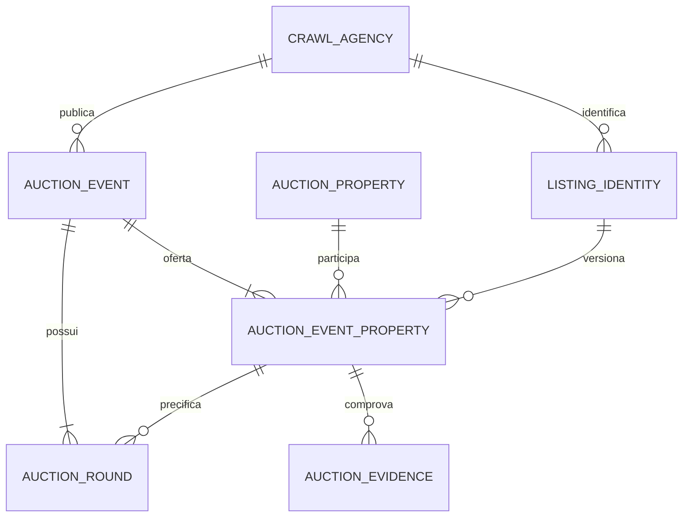
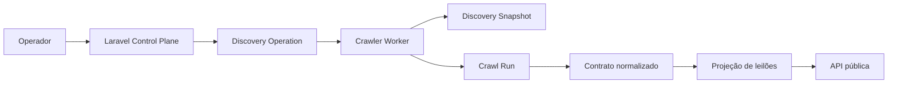

# Módulo de Leilões: Discovery e Arquitetura

**Escopo inicial:** Jaraguá do Sul, SC e região (Norte de Santa Catarina), com fontes nacionais que publiquem imóveis nessa área.

**Data do levantamento:** 27/08/2026. A presença de um imóvel ou evento é dinâmica; a matriz abaixo é um ponto de partida para validação técnica, não uma garantia de disponibilidade.

## Decisões resumidas

1. O produto deve exibir **imóveis/lotes**, mas a unidade de negócio principal é o **evento de venda**.
2. Um evento pode possuir uma ou mais **praças** (1º leilão, 2º leilão, praça única ou venda direta), cada uma com data e valor próprios.
3. A fonte original continua sendo identificada por `crawler.crawl_agencies`; não criar uma segunda tabela de leiloeiros.
4. O crawler continua enviando dados ao Laravel por `crawler.operations` e persistindo evidências em discovery/crawl run. Não haverá acesso direto do crawler ao banco de produção nem webhook público no MVP.
5. Criar uma projeção relacional específica para consultas públicas, sem substituir `raw_properties`, `market_properties`, snapshots e versionamento existentes.
6. Edital, matrícula e página original são evidências: devem guardar URL, data de observação e, quando possível, hash/artefato do documento.

## Matriz inicial de fontes

| Prioridade | Fonte | Cobertura esperada | Entrada pública | Estratégia inicial | Risco | Decisão |
| --- | --- | --- | --- | --- | --- | --- |
| P0 | Imóveis CAIXA | Nacional, filtrável por SC; inclui leilão, licitação aberta, venda online e compra direta | [Busca de imóveis](https://venda-imoveis.caixa.gov.br/sistema/busca-imovel.asp?sltTipoBusca=imoveis), [lista completa](https://venda-imoveis.caixa.gov.br/sistema/download-lista.asp), calendário e documentos no portal institucional | Priorizar lista/download e documentos oficiais; usar a página do leiloeiro apenas como complemento | Modalidades diferentes de leilão; edital é indispensável; portal pode exigir fluxo de formulário | **Incluir no MVP**, separado por modalidade |
| P0 | Leiloeiro Público | SC e estados próximos; páginas de oferta com cidade, tipo, data e status | [Ofertas públicas](https://www.leiloeiropublico.com.br/), [calendário](https://www.leiloeiropublico.com.br/Calendario.aspx) | Discovery por páginas de categoria/calendário e detalhe `ListagemLote.aspx?Leilao=...` | ASP.NET/PostBack, layout legado e paginação; confirmar regras de acesso e estabilidade | **Primeiro spider de validação** |
| P1 | Superbid Exchange | Nacional; plataforma agrega agentes e exibe imóveis com praça, metragem, ocupação e valores | [Categoria de imóveis](https://www.superbid.net/categorias/imoveis) | Discovery por categoria/evento/oferta; extrair apenas itens cuja localização esteja no escopo | Conteúdo e filtros podem depender de JavaScript; login é necessário para participar, não para a vitrine | **Adicionar após P0** |
| P1 | Mega Leilões | Nacional; páginas de imóveis, eventos, lotes e cidades | [Leilão de imóveis](https://www.megaleiloes.com.br/imoveis) | Discovery por categoria/cidade e detalhe do evento/lote | Site protegido; parâmetros de campanha e paginação; validar robots/limites | **Adicionar após P0** |
| P2 | Tribunais, prefeituras e leiloeiros regionais | Judicial e administrativo, com maior relevância local | A descobrir via prospecção do crawler, portais oficiais e editais indexados | Cadastrar como `prospect` até confirmar domínio, termos e repetibilidade | Alta fragmentação e muitos PDFs; custo de manutenção elevado | **Discovery contínuo, sem spider no primeiro ciclo** |

### Critério de aceite de uma fonte

Uma fonte só vira `CrawlAgency` ativa quando, em duas execuções separadas, for possível:

- encontrar pelo menos um imóvel do escopo geográfico;
- obter identificador estável do evento e do lote, ou uma chave canônica reproduzível;
- obter URL do detalhe e, quando existir, URL do edital;
- extrair data, modalidade, valor de avaliação e valor mínimo sem inferir silenciosamente;
- distinguir as praças do mesmo lote;
- registrar status HTTP, robots/termos, latência e presença de CAPTCHA/login;
- comparar a segunda coleta com a primeira e classificar `new`, `changed`, `unchanged` ou `removed`.

## Modelo de domínio

### Entidades

- **AuctionEvent (`auction_events`)**: o processo/evento publicado pela fonte, por exemplo, um leilão judicial ou uma venda de imóveis CAIXA.
- **AuctionRound (`auction_rounds`)**: uma oportunidade temporal e financeira do evento: 1ª praça, 2ª praça, praça única ou venda direta.
- **AuctionProperty (`auction_properties`)**: o lote imobiliário que será exibido, com endereço, descrição, situação de ocupação, avaliação e evidências.
- **AuctionEventProperty (`auction_event_properties`)**: vínculo entre evento e lote. Permite que um mesmo imóvel apareça em novo evento sem duplicar sua identidade física.
- **AuctionEvidence (`auction_evidences`)**: URLs e artefatos observados, principalmente detalhe, edital, matrícula e fotos. A linhagem técnica continua em `crawler.*`.

### Relacionamentos



### Campos mínimos da projeção

`auction_events`:

- `id`, `crawl_agency_id`, `external_key`, `canonical_url`;
- `title`, `sale_modality` (`judicial`, `extrajudicial`, `administrative`, `direct_sale`, `unknown`);
- `status` (`scheduled`, `open`, `closed`, `cancelled`, `unknown`);
- `auctioneer_name`, `court_or_seller`, `published_at`, `source_payload`;
- `first_observed_at`, `last_observed_at`, timestamps.

`auction_rounds`:

- `auction_event_property_id`, `round_number`, `starts_at`, `ends_at`;
- `appraisal_value`, `minimum_bid`, `current_bid`, `commission_rate`;
- `status`, `source_label`, `source_payload`.

`auction_properties`:

- `id`, `property_key`, `property_type`, `title`, `description`;
- `address`, `neighborhood`, `city`, `state`, `postal_code`, latitude/longitude nullable;
- `built_area_m2`, `land_area_m2`, `occupancy_status`, `registration_number` nullable;
- `source_payload`, timestamps.

`auction_event_properties`:

- `auction_event_id`, `auction_property_id`, `listing_identity_id`;
- `lot_number`, `canonical_url`, `inventory_state`;
- `current_round_id` nullable, `observed_at`, timestamps;
- unique key on `(auction_event_id, lot_number)` and index by city/state/status through the related property/event.

`auction_evidences`:

- `auction_event_property_id`, `kind` (`detail`, `notice`, `registry`, `photo`, `other`);
- `url`, `content_hash`, `captured_at`, `artifact_id` nullable, `metadata` JSONB.

Valores monetários devem ser `numeric(14,2)`, áreas `numeric(12,2)` e datas `timestamptz`. Valores ausentes permanecem `NULL`; zero não significa “não informado”.

## Contrato normalizado de ingestão

O Crawler Machine deve produzir um registro compatível com o contrato de mercado já versionado, com uma extensão de leilões:

```json
{
  "domain": "auction",
  "source": { "external_id": "26.093", "canonical_url": "https://..." },
  "event": {
    "title": "Imóvel ...",
    "sale_modality": "judicial",
    "status": "open",
    "auctioneer_name": "...",
    "seller_or_court": "..."
  },
  "property": {
    "lot_number": "1",
    "property_type": "house",
    "city": "Jaraguá do Sul",
    "state": "SC",
    "address": "...",
    "occupancy_status": "unknown"
  },
  "rounds": [
    { "round_number": 1, "starts_at": "2026-09-01T14:00:00-03:00", "minimum_bid": 350000.00 },
    { "round_number": 2, "starts_at": "2026-09-15T14:00:00-03:00", "minimum_bid": 210000.00 }
  ],
  "evidence": [
    { "kind": "notice", "url": "https://..." }
  ]
}
```

O payload acima é observacional. O backend valida tipos e estados, mas não inventa valores ausentes nem transforma descrição textual em fato sem `confidence` e evidência.

## Integração e operação



- O operador cadastra o domínio como prospecto ou `CrawlAgency` e enfileira discovery.
- O worker descobre URLs, registra snapshot imutável e só depois executa extração.
- Cada lote recebe identidade estável por `(crawl_agency_id, external_id)`; fallback é hash da URL canônica, seguindo ADR 0013.
- Publicação passa pela mesma qualidade/quarentena usada no mercado. Um lote não é público apenas porque foi encontrado.
- O frontend consulta apenas eventos/lotes publicados e recebe `source_url`, `notice_url` e `last_observed_at`.
- Não baixar nem contornar CAPTCHA. Quando a fonte exigir autenticação, captcha ou interação para dados essenciais, marcar `blocked` e conservar a URL para consulta humana.

## Backlog técnico da próxima etapa

1. Confirmar cinco a dez casos reais de imóveis em Jaraguá do Sul e cidades vizinhas nas fontes P0/P1.
2. Implementar o spider de validação do Leiloeiro Público e uma fixture do contrato normalizado.
3. Implementar CAIXA por lista/documento, com modalidade explícita e evidência do edital.
4. Criar migrations/models da projeção somente após as fixtures estabilizarem os campos e chaves.
5. Adicionar filtros de cidade/UF, modalidade, status, data da próxima praça, avaliação e lance mínimo.
6. Criar teste de regressão para: duas praças, imóvel repetido em outro evento, evento cancelado e URL alterada.

## Riscos e perguntas abertas

- A cobertura de Jaraguá do Sul deve incluir apenas o município ou também Guaramirim, Schroeder, Corupá, Barra Velha e Joinville?
- “Leilão” deve incluir venda direta, compra direta e licitação aberta ou somente judicial/extrajudicial?
- O produto precisa guardar matrícula/documentos para download ou apenas linkar para a fonte?
- É necessário um histórico de preços por praça na interface pública?
- A publicação pode mostrar imóveis ocupados e direitos/parte ideal, ou essas categorias serão filtradas?
