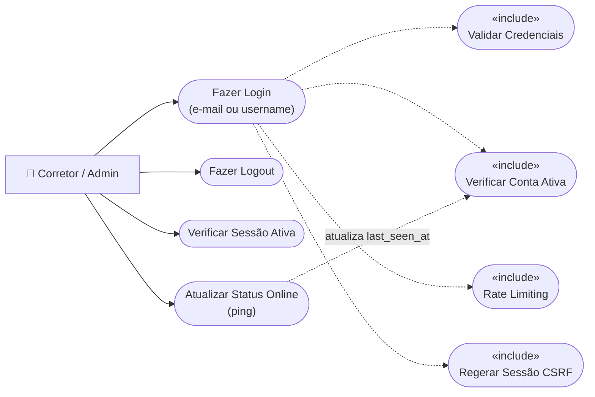
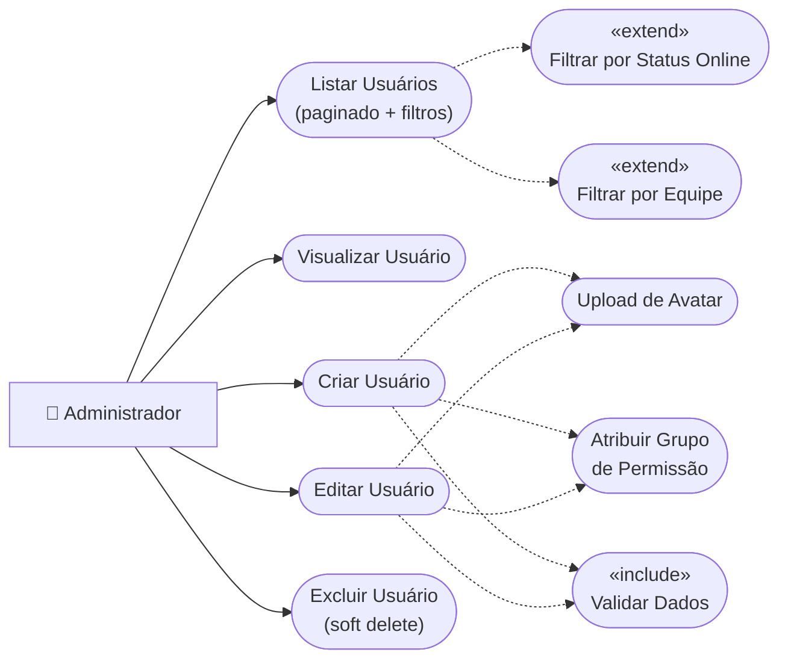
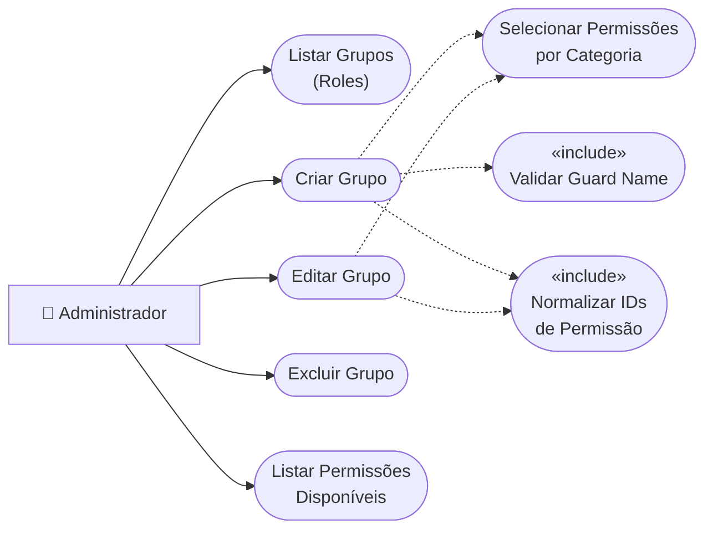
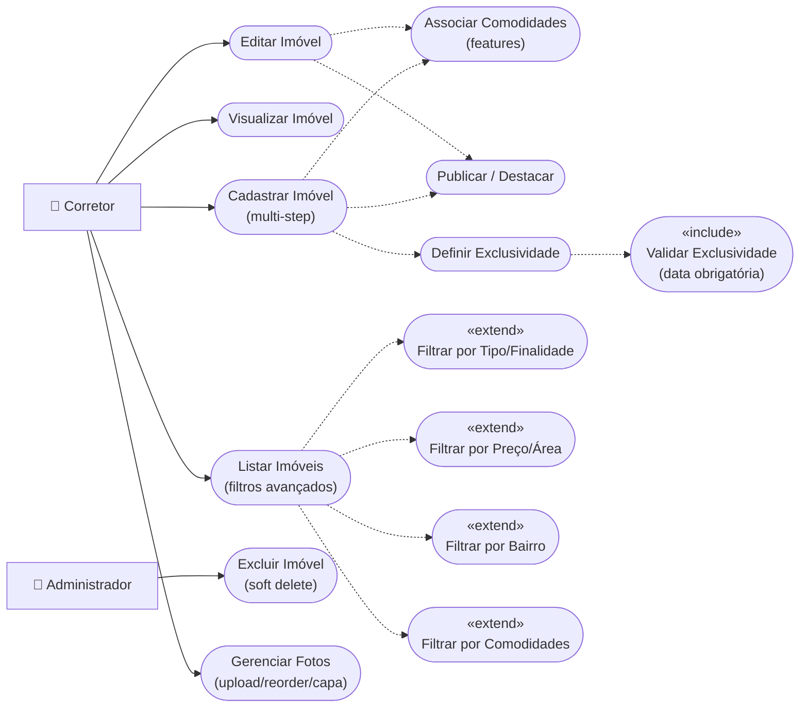
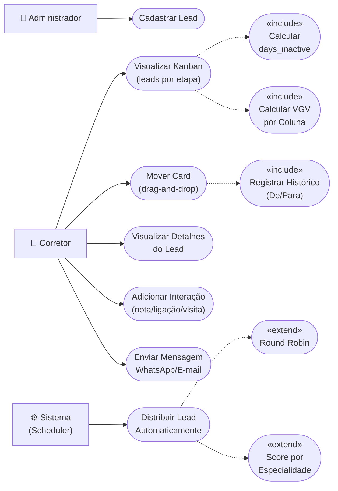
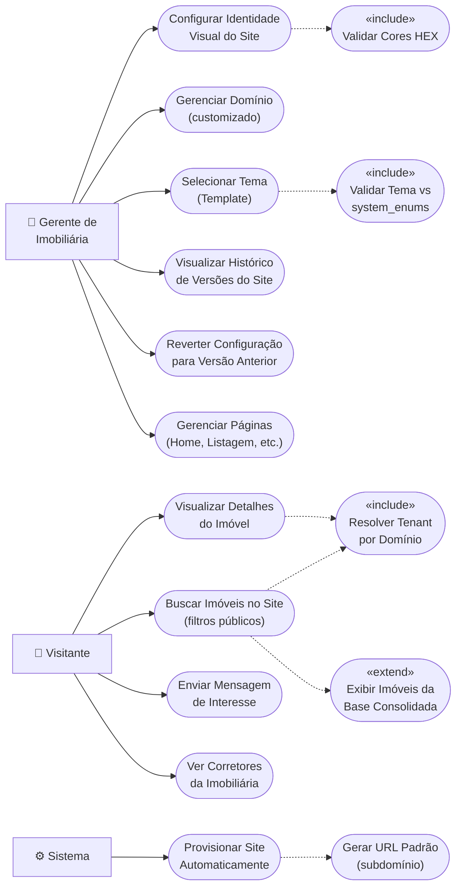
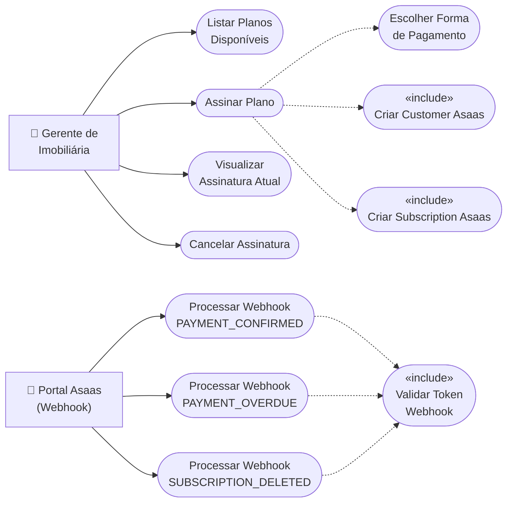
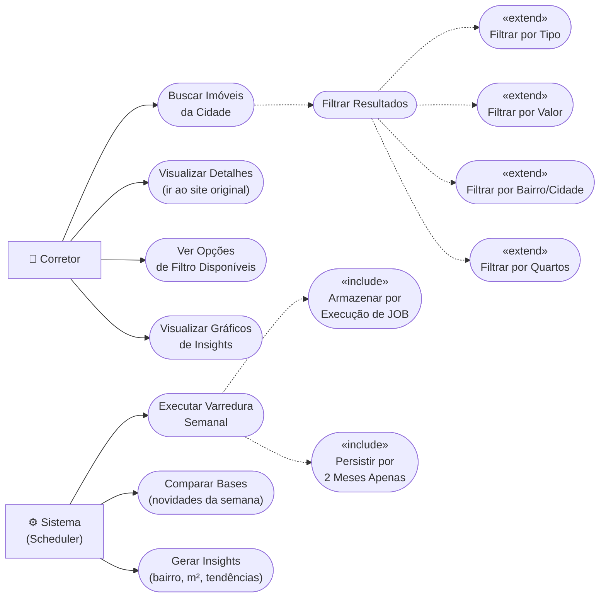
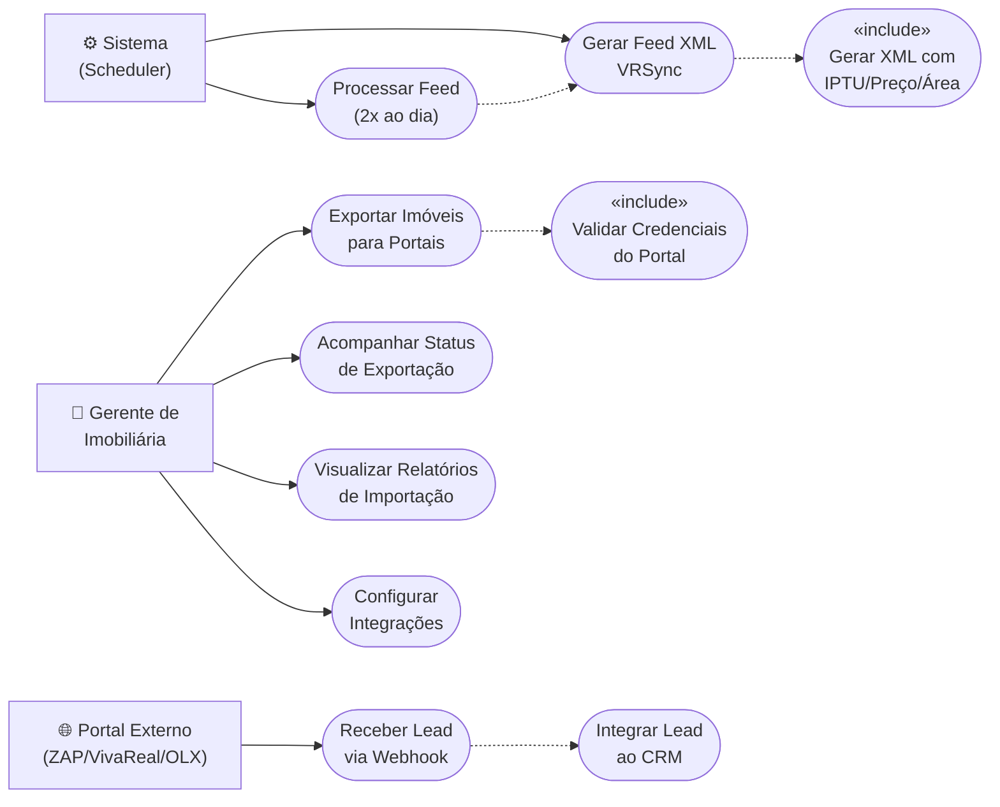

# Diagramas de Caso de Uso — ia-imob

> Documentação UML de Casos de Uso para todos os módulos do sistema, derivada do [PRD](file:///home/vinicius/apps/ia-imob/docs/roadmaps/PRD.md), das especificações técnicas e dos requisitos funcionais do PAC.

> [!NOTE]
> Mermaid não possui suporte nativo a diagramas de caso de uso UML. Os diagramas abaixo utilizam `flowchart LR` com convenção visual: **atores à esquerda** (`🧑 Actor`), **casos de uso como nós arredondados no centro**, e relações `include`/`extend` diferenciadas por tracejado.

---

## Sumário

1. [Login e Autenticação](#1-login-e-autenticação)
2. [Gestão de Usuários](#2-gestão-de-usuários)
3. [Grupos de Usuários — RBAC](#3-grupos-de-usuários--rbac)
4. [Cadastro de Imóveis](#4-cadastro-de-imóveis)
5. [Gestão de Leads — CRM](#5-gestão-de-leads--crm)
6. [Gerador de Sites White-Label — B2B SaaS](#6-gerador-de-sites-white-label--b2b-saas)
7. [Pagamento Recorrente — Asaas](#7-pagamento-recorrente--asaas)
8. [AI Searcher — Base Consolidada de Jaraguá](#8-ai-searcher--base-consolidada-de-jaraguá)
9. [Ecossistema de Integração](#9-ecossistema-de-integração)

---

## Atores do Sistema

| Ator | Descrição |
|------|-----------|
| **Corretor** | Usuário operacional do sistema. Gerencia imóveis, atende leads, usa o painel CRM |
| **Administrador** | Superusuário com permissões totais. Gerencia usuários, grupos, configurações do sistema |
| **Gerente de Imobiliária** | Dono/gestor da imobiliária (tenant). Configura site, planos, integrações |
| **Visitante** | Usuário anônimo que acessa o site público da imobiliária |
| **Sistema (Scheduler)** | Processos automatizados (Jobs, Cron, Webhooks) |
| **Portal Externo** | Plataformas externas (ZAP, VivaReal, OLX, Asaas) |

---

## 1. Login e Autenticação

**Status:** ✅ Implementado

### Descrição dos Casos de Uso

| ID | Caso de Uso | Ator | Descrição |
|----|-------------|------|-----------|
| UC1.1 | Fazer Login | Corretor/Admin | Autentica via e-mail ou username + senha. Regenera sessão e token CSRF |
| UC1.2 | Fazer Logout | Corretor/Admin | Invalida sessão e regenera CSRF token |
| UC1.3 | Verificar Sessão | Corretor/Admin | Endpoint `/api/user` retorna usuário autenticado ou 401 |
| UC1.4 | Atualizar Status Online | Corretor/Admin | Endpoint `/api/ping` atualiza `last_seen_at` periodicamente |

---

## 2. Gestão de Usuários

**Status:** ✅ Implementado

### Descrição dos Casos de Uso

| ID | Caso de Uso | Ator | Pré-condição |
|----|-------------|------|--------------|
| UC2.1 | Listar Usuários | Admin | Permissão `users.view` |
| UC2.2 | Visualizar Usuário | Admin | Permissão `users.view` |
| UC2.3 | Criar Usuário | Admin | Permissão `users.create`. Dados validados via `StoreUserRequest` |
| UC2.4 | Editar Usuário | Admin | Permissão `users.edit.all` ou `users.edit.self` (somente próprio) |
| UC2.5 | Excluir Usuário | Admin | Permissão `users.delete`. SoftDelete |
| UC2.6 | Upload Avatar | Admin | Arquivo `image/jpeg,png` ≤ 2MB |
| UC2.7 | Atribuir Grupo | Admin | Role existente no Spatie |

---

## 3. Grupos de Usuários — RBAC

**Status:** ✅ Implementado

### Descrição dos Casos de Uso

| ID | Caso de Uso | Ator | Regras |
|----|-------------|------|--------|
| UC3.1 | Listar Grupos | Admin | Permissão `roles.manage`. Retorna roles com permissões associadas |
| UC3.2 | Criar Grupo | Admin | Nome único. Permissões normalizadas para o guard correto |
| UC3.3 | Editar Grupo | Admin | Sincroniza permissões via `syncPermissions()` |
| UC3.4 | Excluir Grupo | Admin | Grupo "Administrador" protegido contra exclusão |
| UC3.5 | Listar Permissões | Admin | Lista todas as permissões disponíveis agrupadas por categoria |

---

## 4. Cadastro de Imóveis

**Status:** 🔧 Em Desenvolvimento

### Descrição dos Casos de Uso

| ID | Caso de Uso | Ator | Regras |
|----|-------------|------|--------|
| UC4.1 | Listar Imóveis | Corretor | `properties.view`. Filtros: tipo, finalidade, status, cidade, bairro, preço, quartos, comodidades |
| UC4.2 | Visualizar Imóvel | Corretor | Carrega imagens, comodidades, corretor e proprietário |
| UC4.3 | Cadastrar Imóvel | Corretor | `properties.create`. Formulário multi-step. Domínios dinâmicos via `system_enums` |
| UC4.4 | Editar Imóvel | Corretor | `properties.edit.self` (próprios) ou `properties.edit.all` (todos) |
| UC4.5 | Excluir Imóvel | Admin | `properties.delete`. SoftDelete |
| UC4.6 | Gerenciar Fotos | Corretor | Upload drag-and-drop, reordenação, definir capa. Auto-capa se primeiro upload |
| UC4.7 | Associar Comodidades | Corretor | Pivot M:N `property_feature` via `sync()` |
| UC4.8 | Publicar/Destacar | Corretor | Flags `is_published`, `is_highlighted` |
| UC4.9 | Definir Exclusividade | Corretor | Se `has_exclusive_right = true`, `exclusive_right_expiration_date` obrigatória |

---

## 5. Gestão de Leads — CRM

**Status:** 📋 Planejado

### Descrição dos Casos de Uso

| ID | Caso de Uso | Ator | Regras |
|----|-------------|------|--------|
| UC5.1 | Visualizar Kanban | Corretor | `leads.view`. Cards agrupados por `FunnelStep`. Exibe `days_inactive` e VGV |
| UC5.2 | Mover Card | Corretor | `leads.manage`. Atualiza `funnel_step_id` e `status_id`. Observer gera log na `Interaction` |
| UC5.3 | Cadastrar Lead | Admin | `leads.manage`. Campos: nome, email, telefone, origem, valor esperado |
| UC5.4 | Visualizar Detalhes | Corretor | `leads.view`. Exibe timeline de interações e quick actions |
| UC5.5 | Adicionar Interação | Corretor | `leads.edit.self`. Tipo: anotação, ligação, e-mail, visita |
| UC5.6 | Enviar Mensagem | Corretor | Quick action via deep-link WhatsApp / mailto |
| UC5.7 | Distribuir Lead | Sistema | Automático ao receber novo lead. Round Robin ou Score por especialidade do corretor |

---

## 6. Gerador de Sites White-Label — B2B SaaS

**Status:** 📋 Planejado

### Descrição dos Casos de Uso

| ID | Caso de Uso | Ator | Regras |
|----|-------------|------|--------|
| UC6.1 | Configurar Identidade Visual | Gerente | `sites.manage`. Upload logo/favicon, cores primária/secundária (hex), WhatsApp, Instagram |
| UC6.2 | Gerenciar Domínio | Gerente | Cadastrar domínio próprio. Instruções de DNS (CNAME/A). Verificação automática |
| UC6.3 | Selecionar Tema | Gerente | Validado contra `site_themes` em `system_enums` |
| UC6.4 | Visualizar Histórico | Gerente | Lista snapshots de configuração (`SiteVersion`) |
| UC6.5 | Reverter Configuração | Gerente | Restaura settings de um `SiteVersion` anterior |
| UC6.6 | Gerenciar Páginas | Gerente | Páginas obrigatórias: Home, Listagem, Informações, Corretores, Contatos |
| UC6.7 | Buscar Imóveis | Visitante | Filtros: tipo, faixa de preço, localização, quartos. Apenas `is_published = true` |
| UC6.8 | Visualizar Detalhes | Visitante | Exibe comodidades, fotos, tour virtual, corretor (dados públicos) |
| UC6.9 | Enviar Mensagem | Visitante | Formulário de contato vinculado ao imóvel de interesse |
| UC6.10 | Ver Corretores | Visitante | Lista corretores com `show_on_website = true` |
| UC6.11 | Provisionar Site | Sistema | Ao cadastrar imobiliária, cria automaticamente `TenantDomain` + `TenantSiteSetting` |

---

## 7. Pagamento Recorrente — Asaas

**Status:** ✅ Implementado

### Descrição dos Casos de Uso

| ID | Caso de Uso | Ator | Regras |
|----|-------------|------|--------|
| UC7.1 | Listar Planos | Gerente | Exibe planos ativos: Mensal (R$299), Semestral (R$249/mês), Anual (R$199/mês) |
| UC7.2 | Assinar Plano | Gerente | `subscriptions.manage`. Cria Customer se não existir → Cria Subscription no Asaas |
| UC7.3 | Visualizar Assinatura | Gerente | `subscriptions.view`. Mostra status, plano, próxima cobrança |
| UC7.4 | Cancelar Assinatura | Gerente | `subscriptions.manage`. Cancela no Asaas e atualiza status local |
| UC7.5 | Escolher Pagamento | Gerente | PIX, Boleto ou Cartão de Crédito (`BillingType` enum) |
| UC7.6 | Webhook Confirmado | Asaas | Ativa assinatura (`status = active`), atualiza `next_due_date` |
| UC7.7 | Webhook Atrasado | Asaas | Inativa assinatura (`status = inactive`) |
| UC7.8 | Webhook Deletado | Asaas | Expira assinatura (`status = expired`), define `ends_at` |

---

## 8. AI Searcher — Base Consolidada de Jaraguá

**Status:** ✅ Implementado (parcial)

### Descrição dos Casos de Uso

| ID | Caso de Uso | Ator | Regras |
|----|-------------|------|--------|
| UC8.1 | Buscar Imóveis | Corretor | Listagem paginada de imóveis extraídos das imobiliárias de Jaraguá do Sul |
| UC8.2 | Filtrar Resultados | Corretor | Filtros: tipo, valor (min/max), bairro, cidade, imobiliária, quartos |
| UC8.3 | Ir ao Site Original | Corretor | Redireciona via `link_imovel` para publicação original |
| UC8.4 | Opções de Filtro | Corretor | Endpoint `/filters` retorna valores distintos para cada campo |
| UC8.5 | Varredura Semanal | Sistema | JOB semanal. Cada execução armazenada em tabela separada |
| UC8.6 | Comparar Bases | Sistema | Compara execuções para identificar novos imóveis da semana |
| UC8.7 | Gerar Insights | Sistema | Extrai: bairro em crescimento, m² mais caro, concentração de imobiliárias |
| UC8.8 | Visualizar Gráficos | Corretor | Gráficos visuais dos insights gerados |

---

## 9. Ecossistema de Integração

**Status:** 📋 Planejado

### Descrição dos Casos de Uso

| ID | Caso de Uso | Ator | Regras |
|----|-------------|------|--------|
| UC9.1 | Exportar Imóveis | Gerente | Seleciona portais destino. Gera feed XML VRSync conforme especificação Grupo OLX |
| UC9.2 | Acompanhar Status | Gerente | Visualiza status do último processamento por portal |
| UC9.3 | Relatórios de Importação | Gerente | Relatórios por e-mail, webhook e painel. Total, sucesso, falhas |
| UC9.4 | Configurar Integrações | Gerente | Tokens de API, endpoints, ativar/desativar por portal |
| UC9.5 | Gerar Feed XML | Sistema | Formato VRSync: IPTU, preço venda/aluguel, taxa admin, tipo, área, quartos, garagens |
| UC9.6 | Processar Feed | Sistema | Job a cada 12h (2x/dia). Alterações, inclusões e exclusões refletidas nos portais |
| UC9.7 | Receber Lead | Portal | Webhook dos portais → CRM Partner Integration / Meta Graph API |
| UC9.8 | Integrar ao CRM | Sistema | Lead automaticamente inserido no CRM com origem = portal |

---

## Legenda

| Símbolo | Significado |
|---------|-------------|
| 🧑 | Ator humano do sistema |
| ⚙️ | Ator sistema (processo automatizado) |
| 🏦 / 🌐 | Ator externo (API/Portal) |
| `(["..."])` | Caso de Uso |
| `-->` | Associação Ator → Caso de Uso |
| `-.->` | Relacionamento `«include»` ou `«extend»` |
| 📋 Planejado | Módulo especificado, não implementado |
| ✅ Implementado | Módulo funcional no código-fonte |
| 🔧 Em Desenvolvimento | Módulo parcialmente implementado |
